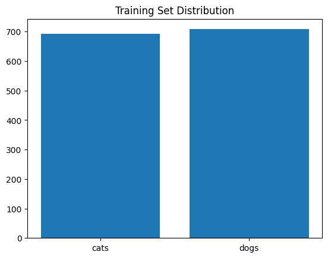
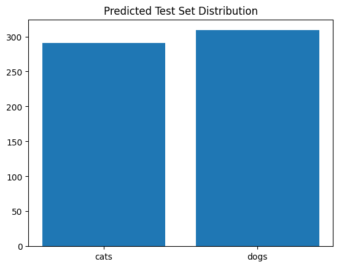
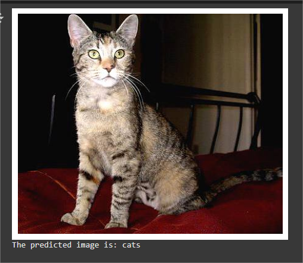
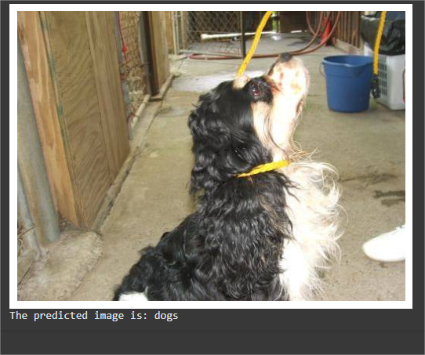

## PRODIGY_ML_03

# 🐱🐶 Cat vs Dog Image Classification Using Support Vector Machine (SVM)

This project was completed as part of the **Machine Learning Internship at Prodigy InfoTech**.  
The aim is to implement a **Support Vector Machine (SVM)** classifier to distinguish between images of cats and dogs.

---

## 📌 Objective

Classify images into **Cat** or **Dog** categories using:
- **Image Preprocessing** (Resizing & Flattening)
- **Feature Extraction**
- **SVM Classifier Training & Testing**

This project serves as a foundation for more complex computer vision systems and demonstrates the use of traditional machine learning in image classification.

---

## 🧾 Dataset

- 📂 Dataset Name: **Dogs vs Cats**
- 📥 Source: [Kaggle Dogs vs Cats](https://www.kaggle.com/datasets/salader/dogs-vs-cats)
- 📊 Structure:
- dogs_vs_cats/
- ├── train/
- │ ├── cats/
- │ ├── dogs/
- ├── test/
- | ├── cats/
- | ├── dogs/

---

## 🧠 Key Concepts

- **SVM (Support Vector Machine)**: Supervised learning algorithm to find the optimal boundary between two classes.
- **Image Preprocessing**: Resizing all images to `(40, 40)` and flattening into a 1D feature vector.
- **Model Evaluation**: Accuracy score, confusion matrix, and classification report.
- **Data Visualization**: Class distribution plots and sample prediction display.

---

## 💻 Technologies Used

| Tool/Library   | Purpose                         |
|----------------|----------------------------------|
| Python         | Programming Language             |
| NumPy          | Numerical Operations             |
| Matplotlib     | Data Visualization               |
| OpenCV / skimage| Image Reading & Resizing        |
| Scikit-learn   | Machine Learning Algorithms      |

---

## 📊 Steps Followed

1. **Data Loading**
 - Read images from `train/` and `test/` folders.
 - Resized to `(40, 40, 3)` and flattened into vectors.

2. **Preprocessing**
 - Imported the essential libraries
 - Converted feature list into NumPy arrays

3. **Splitting Data**
 - Used `train_test_split` to create training and validation sets.

4. **Feature Scaling**
 - #Feature Scaling allows us to put all the features on the same scale 
   
5. **Model Training**
 - Trained SVM with kernel ( `rbf`).
 - SVM is about finding the best decision boundary which would help separate the space into classes.

5. **Evaluation**
 - Checked accuracy score.
 - Generated confusion matrix & classification report.

6. **Visualization**
 - Bar chart showing training set distribution and test set distributions
 - Sample predictions for random test images.

---

## 🔗 Open in Google Colab

---

## 📈 Training Set Distribution

  

-Both bars are around 700 that means I have roughly 700 cat images and 700 dog images in my training set.
-This shows my dataset is balanced, which is good for training a SVM .

---

## 📈 Test Set Distribution
  

-The left bar is slightly lower (~290) than the right (~310), meaning my model predicted a few more dogs than cats in the test set.
-This doesn’t tell us accuracy — it only tells us how balanced or imbalanced the predictions are.

---

## 📸 Sample Predictions for cat and dog 

  

  

---

## 🔍 Insights Gained

- Balanced dataset helps prevent bias in model predictions.
- Linear SVM is fast and decent for small images.
- RBF kernel might improve accuracy but increases computation time.
- Image preprocessing significantly affects accuracy.

---

